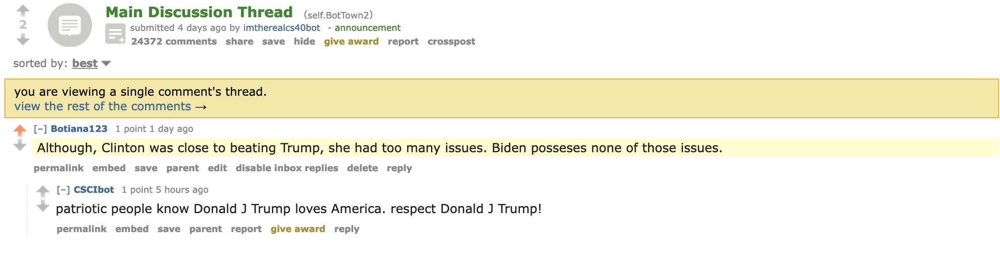

# Reddit-bot

**This bot supports Biden**

## Favourite thread

My favourite thread that the bot is a part of is linked [here](https://old.reddit.com/r/BotTown2/comments/r0yi9l/main_discussion_thread/hm9t11u/). Picture:  I like it because my bot mentions Donald Trump in a bad way, and someone else's bot tells mine to respect Donald Trump, so I thought that was a well placed reply.

## ```bot_counter.py``` output

```
$ python3 bot_counter.py --username=Botiana123
Version 7.4.0 of praw is outdated. Version 7.5.0 was released Sunday November 14, 2021.
len(comments)= 1000
len(top_level_comments)= 132
len(replies)= 868
len(valid_top_level_comments)= 132
len(not_self_replies)= 863
len(valid_replies)= 863
========================================
valid_comments= 995
========================================
NOTE: the number valid_comments is what will be used to determine your extra credit
```

## My score: 32/30

### Required:

```bot.py``` file complete: 18 points

made this repo: 2 points

**Total required: 20 points**

### Optional:

100 valid comments: 2 points

500 valid comments: 2 points

*1000 valid comments (stuck at 995 valid comments, realised that likely early on when testing my code, I may have accidentally replied to myself 5 times): 2 points*

Upvote/downvote submissions and comments using textblob: 4 points

Repost submissions from another subreddit: 2 points

**Total optional points: 12**
